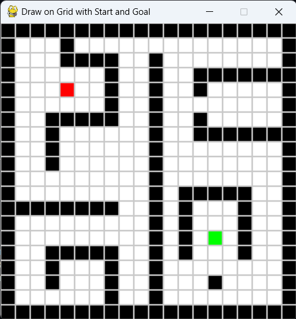

# Path-Planning
Algorithm: The A* algorithm is a popular graph search algorithm used for finding the shortest path between two points in a graph. It's known for its completeness, optimality, and efficiency in many computer science applications. A* employs a heuristic function to estimate the cost of reaching the goal from a given node, guiding the search towards promising paths. 

For each node in the open set, calculate its f-score (estimated cost to reach the goal) using formula f(n) = g(n) + h(n), where g(n) is the cost to reach the current node and h(n) is the heuristic estimate. 

Consider finding the shortest path from point A to point B in a grid map. A* would use a heuristic (like Manhattan distance) to estimate the distance between each node and point B. The algorithm would then explore the grid, prioritizing nodes that are likely to be closer to point B based on the heuristic and the actual path cost. 

heuristic function - Manhatten Distance (Since Manhattan distance calculates the distance between two points by summing the absolute differences of their coordinates, making it suitable for grid-based pathfinding where movement is restricted to horizontal and vertical directions.)

## Input

## Output

